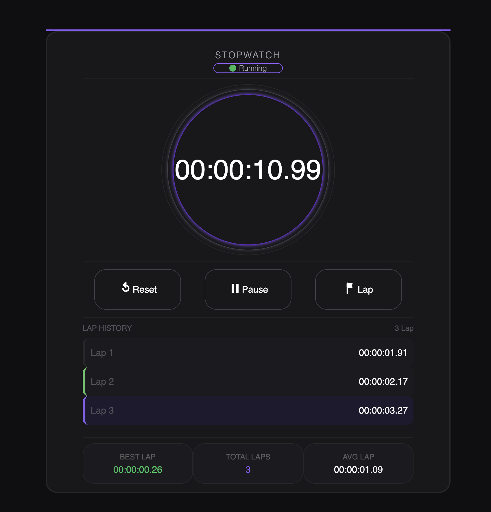

# ⏱️ Stopwatch

A simple and responsive stopwatch built using **HTML, CSS, and JavaScript**. The project provides basic time-tracking functionality with controls to start, pause, and reset the stopwatch.

## 🌐 Live Demo

👉 [View Live Demo](https://stopwatch-mu-inky.vercel.app/)

## 📸 Preview



## ✨ Features

- ▶️ Start the stopwatch
- ⏸️ Pause the stopwatch
- 🔄 Reset the stopwatch
- ⏱️ Displays elapsed time dynamically
- 📱 Responsive and simple user interface
- ⚡ Real-time updates using JavaScript

## 🛠️ Tech Stack

- **HTML5** — Structure and layout
- **CSS3** — Styling and responsive design
- **JavaScript** — Stopwatch logic, timing, and DOM manipulation

## 🧩 JavaScript Concepts Practiced

This project helped me practice and strengthen:

- DOM Manipulation
- Event Listeners
- Functions
- Variables
- Conditional Logic
- `setInterval()`
- `clearInterval()`
- Time and interval management
- Dynamic DOM updates
- Managing application state

## 🚀 How to Run Locally

### 1. Clone the repository

```bash
git clone YOUR_REPOSITORY_URL
